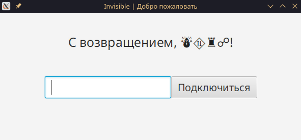

# InvisibleDesktop

Cross-platform desktop client for the Invisible secure messaging platform. Built with JavaFX for anonymous, encrypted communications.

## Features

- 🔒 End-to-end AES-256 encrypted messaging
- 🎭 Anonymous user identification using emoji-based IDs
- 👥 Group chat support with password-based access
- 💻 Cross-platform compatibility (Windows, macOS, Linux)
- 🎨 Minimalist and intuitive JavaFX UI
- ⚡ Real-time message delivery
- 🔑 Automatic client ID generation

## Demo

### Authentication Interface
The application welcomes you with your unique emoji-based ID and a simple password field for group access.



### Chat Interface
Once connected, you can participate in completely anonymous group conversations where all users are identified only by emoji hashes.


## Requirements

- Java 16 or higher
- Maven 3.6+ (for building from source)

## Installation

### Direct Download
Download the latest pre-built JAR from [Releases](https://github.com/HastG99/InvisibleDesktop/releases) and run:
```bash
java -jar InvisibleDesktop.jar
```

### Building from Source
```bash
git clone https://github.com/yourusername/InvisibleDesktop.git
cd InvisibleDesktop
mvn clean package
java -jar target/InvisibleDesktop-1.0-SNAPSHOT.jar
```

## Usage

1. **First Launch**: The application automatically generates a unique client ID
2. **Connect to Group**: Enter the group password to join a chat session
3. **Start Messaging**: Type messages in the text field and press Send
4. **Stay Anonymous**: Your identity is represented by a unique emoji combination

## Configuration

Client settings are stored in `invisibledesktop.properties`:
- `host` - Server address (default: localhost)
- `port` - Server port (default: 11337)
- `id` - Unique client identifier (automatically generated)

## Security Features

- Messages encrypted with AES-256 using group password-derived keys
- No personal data collection or storage
- Unique emoji-based identifiers instead of usernames
- Local configuration storage

## Project Structure

```
InvisibleDesktop/
├── src/main/java/
│   └── ru/study/invisibledesktop/
│       ├── controller/          # UI controllers
│       ├── core/               # Core functionality
│       │   ├── converters/     # Encryption and text conversion
│       │   ├── objects/        # Data models
│       │   └── packets/        # Network packet handling
│       └── InvisibleApplication.java
└── src/main/resources/
    └── ru/study/invisibledesktop/
        ├── authorization.fxml  # Login UI
        └── chat.fxml          # Chat UI
```

## Development

### Dependencies
- JavaFX 17.0.6
- JUnit 5.10.0 (for testing)

### Building with Maven
```bash
mvn clean compile
mvn javafx:run
```

### Package for Distribution
```bash
mvn clean package
```

## Contributing

1. Fork the repository
2. Create a feature branch (`git checkout -b feature/amazing-feature`)
3. Commit your changes (`git commit -m 'Add amazing feature'`)
4. Push to the branch (`git push origin feature/amazing-feature`)
5. Open a Pull Request

## License

This project is licensed under the MIT License - see the [LICENSE](LICENSE) file for details.

## Support

For support and questions, please open an issue on GitHub.

## Related Projects

- [InvisibleServer](https://github.com/HastG99/InvisibleServer) - Backend server for the messaging platform

---

**Note**: This application is designed for educational purposes. Always ensure compliance with local laws and regulations regarding encrypted communications.
